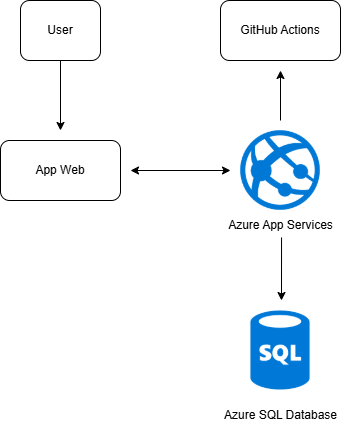
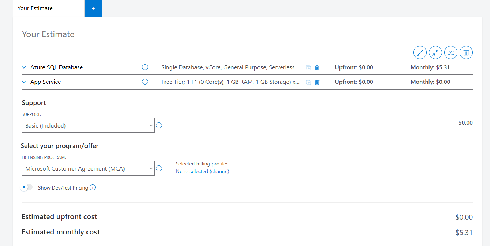
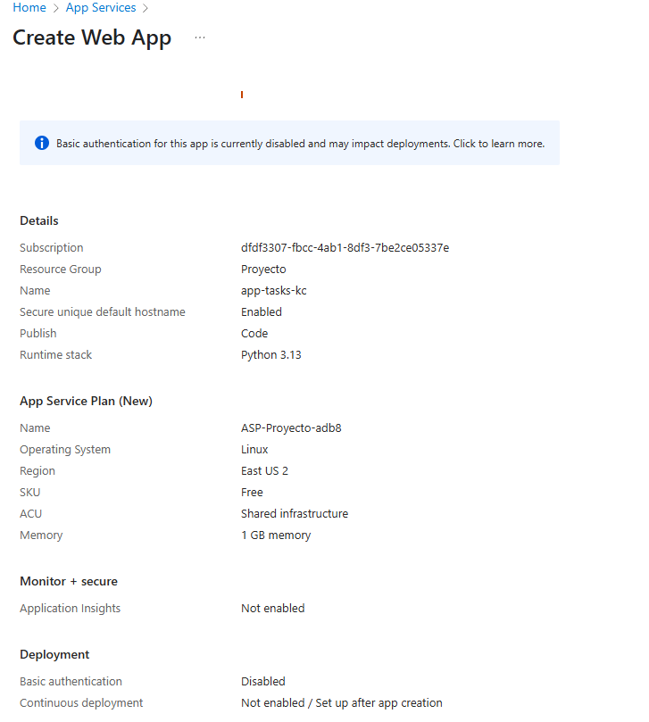
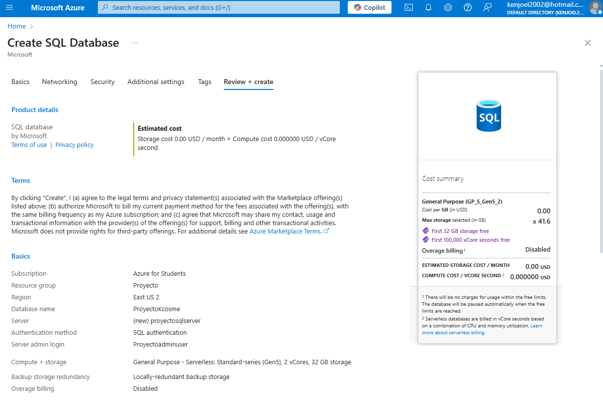
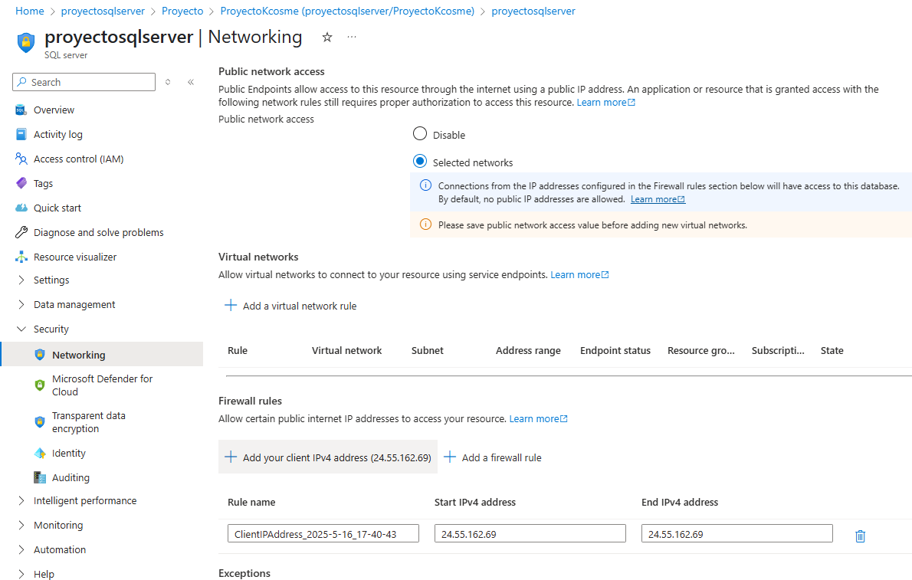
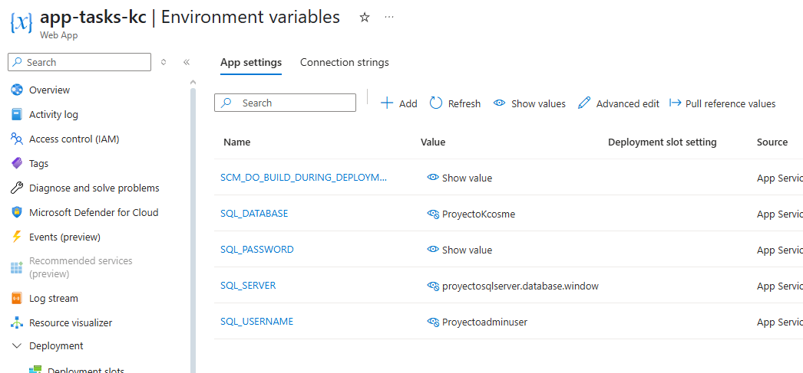
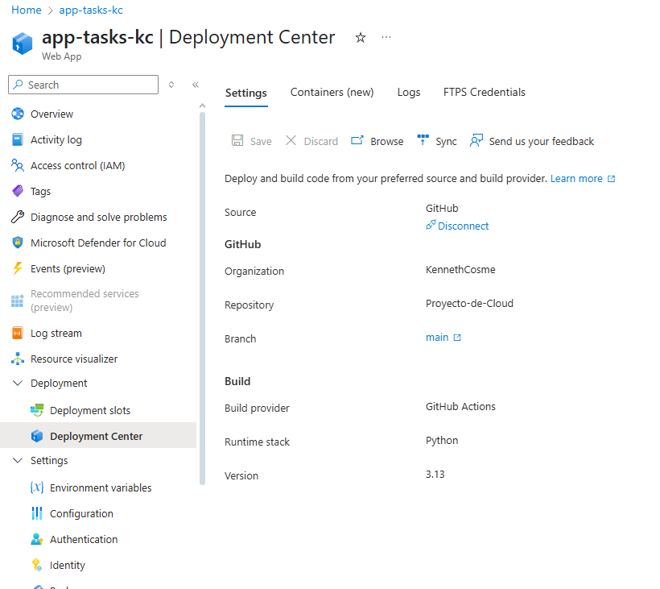

# 📌 Gestor de Tareas en la Nube con Azure y Flask

Proyecto desarrollado como parte del curso de Cloud Computing utilizando **Azure for Students**.  
La aplicación permite crear, completar y eliminar tareas mediante una app web construida con **Flask**, desplegada en **Azure App Service** y con persistencia en **Azure SQL Database**.

---

## 🧑‍💻 Integrantes del Equipo

**Kenneth J. Cosme Ortiz** – R00598658 – kenjoel2002@hotmail.com

---

## 🎯 Descripción General

Esta aplicación permite gestionar tareas básicas a través de una interfaz web desarrollada con Flask y alojada en Azure.

- **¿Qué hace?** Permite añadir, marcar como completadas y eliminar tareas.  
- **¿A quién va dirigida?** A estudiantes y personas que necesiten una herramienta básica para organizar sus tareas.  
- **¿Qué problema resuelve?** Brinda una solución práctica y simple para llevar el control de pendientes en la nube, accesible desde cualquier lugar.

---

## ☁️ Servicios de Azure Utilizados

| Servicio           | Propósito dentro del proyecto                    | Gratuito en Azure for Students |
|--------------------|--------------------------------------------------|-------------------------------|
| Azure App Service  | Alojamiento de la app web Flask                  | ✅ Sí                         |
| Azure SQL Database | Almacenar las tareas creadas por los usuarios   | ✅ Sí                         |
| GitHub Actions     | Automatizar despliegue continuo desde GitHub    | ✅ Sí                         |

---

## 🧱 Diagrama de Arquitectura
Descripción: 

- Usuario accede a la App Web 

- Azure App Service ejecuta la app Flask 

- Flask se conecta a Azure SQL Database 

- GitHub Actions automatiza el despliegue desde GitHub
  


---

## ⚙️ Despliegue y Configuración

### 1. Preparación Local

```bash
git clone https://github.com/KennethCosme/azure_students_project
cd azure_students_project
python -m venv venv
venv\Scripts\activate  # En Windows
pip install -r requirements.txt
python app.py
```

### 2. Configuración en Azure

- Azure SQL Database creada desde el portal.
1. Cree un recurso.
2. Busque **"SQL Database"** y seleccióne la pestaña **"Básico"**
   - **Nombre la base de datos**: ProyectoKcosme
   - **Servidor**: Cree uno nuevo
     - Nombre del servidor: proyectosqlserver
     - Nombre de administrador: Proyectoadminuser
     - Puse una contraseña segura
4. Seleccione **"Plan Gratuito"**.

>(base de datos y servidor ambas estan en East US 2)

- Variables de entorno definidas en App Service:
  - `SQL_SERVER`
  - `SQL_DATABASE`
  - `SQL_USERNAME`
  - `SQL_PASSWORD`
- App Service en Linux con Python 3.8 (Plan F1 gratuito).
- Firewall configurado para permitir la IP local.

### 3. Automatización con GitHub Actions

- Deployment Center conectado a GitHub.
- Azure detecta Flask y despliega automáticamente.
- El archivo `requirements.txt` permite la instalación.

---

## 💻 Enlace a la Aplicación

👉 [https://app-tasks-kc-fvc7dkfdgufmaeeg.eastus2-01.azurewebsites.net](https://app-tasks-kc-fvc7dkfdgufmaeeg.eastus2-01.azurewebsites.net)

---

## 💸 Estimación del Costo

- Azure App Service (F1 - Gratis) 

- Azure SQL Database (S0 - nivel más básico) 



> Costo estimado sin beneficios gratuitos: $5 USD mensuales  

---

## 📁 Capturas del Portal de Azure


- App Service



- SQL Database



- Firewall configurado



- Variables de entorno



- GitHub Deployment Center


---

## 📘 Lecciones Aprendidas

Durante el desarrollo enfrenté dos errores importantes:

1. Datos faltantes en `app.py` que impedían la conexión.
2. Archivos faltantes en GitHub que causaban fallas en el despliegue.

Ambos fueron solucionados revisando la documentación del tutorial y asegurando que todo el contenido estuviera completo.  
Además, aprendí cómo automatizar despliegues con GitHub Actions y entendí el flujo de trabajo de servicios en la nube.

> Esta experiencia me dio confianza para trabajar con herramientas modernas de despliegue y automatización en Azure.

---

## 📚 Repositorio del Código

[https://github.com/KennethCosme/Proyecto-de-Cloud](https://github.com/KennethCosme/Proyecto-de-Cloud)

---

## 📄 Instrucciones para Reproducir el Proyecto

```bash
git clone https://github.com/tu_usuario/azure_students_project
cd azure_students_project
python -m venv venv
venv\Scripts\activate
pip install -r requirements.txt
```

Crear base de datos o usar la ya configurada en Azure. Luego, definir estas variables de entorno:


| Nombre             | Valor                         |
|--------------------|-------------------------------|
| SQL_SERVER         | nombre-servidor.database.windows.net |
| SQL_DATABASE       | nombre_base_datos             |
| SQL_USERNAME       | nombre_usuario@nombre-servidor |
| SQL_PASSWORD       | contraseña_segura             |


Y ejecutar:

```bash
python app.py
```

Accede desde `http://localhost:5000` o desde la URL del App Service.

---

## ✅ Revisión Final del Proyecto

- ✅ App funcional desplegada en Azure
- ✅ Solo servicios gratuitos utilizados
- ✅ Diagrama de arquitectura incluido
- ✅ Instrucciones detalladas
- ✅ Costos estimados descritos
- ✅ Repositorio completo
- ✅ Lecciones aprendidas documentadas
